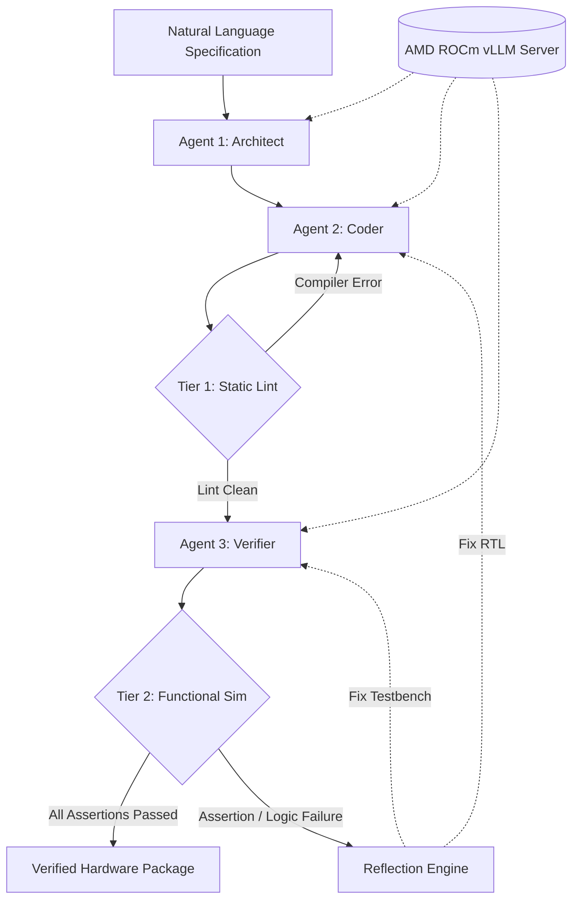
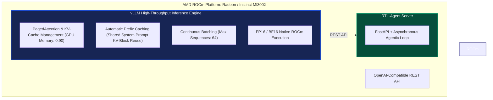

# RTL-Agent: Autonomous Multi-Agent Hardware Verification on AMD ROCm

**Participant:** R. Naga Arjun | Vellore Institute of Technology, Chennai  
**Track:** Track 2: Agentic AI  
**Project:** Autonomous RTL Generation, Static Linting, Functional Simulation, and Digital Waveform Analysis 

- [📄 Read the Full Project Specification](docs/Project_Specification.pdf)
- [📊 View the Pitch Deck](https://docs.google.com/presentation/d/1qKeKEMhVvQ864-Eqo09KVETKo4MwHmZ4/edit?usp=sharing&ouid=106373629719249870202&rtpof=true&sd=true))
- [🎥 Watch the Demo Video](https://www.youtube.com/watch?v=AHY-smP2EEU)

<div align="center">

[](https://rocm.docs.amd.com/)
[](https://huggingface.co/Qwen/Qwen2.5-Coder-7B-Instruct)
[](https://www.veripool.org/verilator/)
[](https://fastapi.tiangolo.com/)
[](frontend/)
[](LICENSE)

</div>

---

## Executive Summary

Functional verification accounts for over 70% of engineering effort and project budgets in modern VLSI and ASIC development. A single undetected functional discrepancy prior to tape-out can lead to physical silicon respins costing upwards of $50M to $100M alongside critical market window delays.

Standard Large Language Models generate plausible SystemVerilog syntax but routinely fail in production hardware design due to three fundamental deficiencies:
1. Absence of closed-loop Electronic Design Automation (EDA) compiler feedback.
2. Inability to synthesize rigorous, cycle-accurate, self-checking verification testbenches.
3. Lack of targeted dual-perspective reflection to isolate structural compilation errors from temporal protocol bugs.

**RTL-Agent** addresses this engineering challenge through an autonomous 3-Agent closed-loop pipeline running on local AMD ROCm hardware via vLLM. Hardware engineers provide high-level natural language specifications; RTL-Agent autonomously produces synthesizable, lint-clean SystemVerilog RTL, cycle-accurate self-checking testbenches, and interactive digital timing diagrams with zero cloud dependencies.

---

## System Architecture

RTL-Agent executes a deterministic, multi-agent linear state machine combined with a two-tier hardware-in-the-loop verification loop.



### Agent Roles and Responsibilities

| Agent | Responsibility | Injected Context & Constraints | Output Artifact |
| :--- | :--- | :--- | :--- |
| **Agent 1: Architect** | Parses natural language specifications; extracts clock domains, reset polarity, parameter definitions, and state encodings; outlines exhaustive verification test cases. | Industry standard SystemVerilog coding conventions, synchronous reset prioritization, protocol timing specifications. | Formal Micro-Architecture Plan and Verification Strategy document. |
| **Agent 2: Coder** | Synthesizes synthesizable SystemVerilog Register-Transfer Level (RTL) code; executes the Tier 1 linting loop. | Strict non-blocking assignment rules (`<=` for sequential, `=` for combinational), complete case branches, port match criteria. | Synthesizable SystemVerilog module (`{session_id}_iter{N}.sv`). |
| **Agent 3: Verifier** | Generates self-checking SystemVerilog testbenches with isolated clock generation, assertions, soft-fail counters, and VCD dumps; manages Tier 2 simulation. | Verilator testbench syntax, isolated clock generators, non-fatal assertion monitoring, timeout watchdogs, `$dumpvars` tracing. | Self-checking testbench (`tb_top.sv`) and Value Change Dump (`dump.vcd`). |

---

## Two-Tier EDA Verification Engine

RTL-Agent interfaces directly with the native C++ Verilator compiler via robust asynchronous subprocesses.

### Tier 1: Static Syntax and Elaboration Linting
Catches syntax bugs, undeclared nets, bit-width truncations, and combinatorial loops before simulation.
```bash
verilator --lint-only -Wall -Wno-style -Wno-fatal --timing <path_to_dut.sv>
```
* On failure, standard error logs are extracted and injected into the Coder Agent's conversation history with structured line pointers.

### Tier 2: Functional Simulation and Waveform Generation
Compiles the Device Under Test (DUT) and the generated testbench into a native multithreaded C++ executable.
```bash
# Compilation Phase
verilator --binary --trace --timing -Wall -Wno-style -Wno-fatal --sv \
          --top-module <top_module_name> \
          -o <sim_binary_path> \
          --Mdir <obj_dir_path> \
          <dut_path> <tb_path>

# Execution Phase
./sim_out
```
* **Soft-Fail Accumulation**: The testbench executes all test vectors, accumulating assertion mismatches in an error counter rather than terminating on the first error, providing comprehensive diagnostic logs to the reflection loop.
* **Trace Extraction**: Value Change Dump (VCD) files are captured, filtered to extract top-level I/O signals, and converted into structured JSON for client-side timing diagram rendering.

---

## AMD ROCm and vLLM Hardware Optimization

RTL-Agent is configured to maximize throughput on AMD ROCm compute platforms (including AMD Radeon and AMD Instinct architectures).



### Key ROCm Optimization Parameters
Configured in `config.py` and exposed via `/api/config`:
* **Prefix Caching (`ENABLE_PREFIX_CACHING=true`)**: Drastically reduces Time-To-First-Token (TTFT) across multi-turn reflection loops by reusing pre-computed KV caches for static architectural and system prompts.
* **GPU Memory Utilization (`GPU_MEMORY_UTILIZATION=0.90`)**: Allocates 90% of available VRAM to KV cache buffers, enabling uninterrupted high-context synthesis.
* **Sequence Concurrency (`MAX_NUM_SEQS=64`)**: Configures continuous batching for simultaneous multi-spec validation.
* **Deterministic Generation (`TEMPERATURE=0.05`)**: Near-zero sampling temperature ensures deterministic, error-minimized SystemVerilog generation.

---

## Benchmark Results

The system was evaluated against the standardized benchmark suite across representative sequential, combinational, and finite state machine designs.

### Per-Design Verification Metrics

| # | Specification Category | Design Name | Tier 1 Lint | Tier 2 Simulation | Iterations | Latency (s) | Throughput |
| :- | :--- | :--- | :--- | :--- | :--- | :--- | :--- |
| 1 | Sequential / Counter | 4-bit Sync Counter | **PASSED** | **PASSED** | 3 | 87.2s | 45.3 tok/s |
| 2 | Shift Register | 8-bit SIPO Shift Register | **PASSED** | **PASSED** | 6 | 240.9s | 38.7 tok/s |
| 3 | Combinational Multiplexer | Parameterized 2-to-1 Mux | **PASSED** | **PASSED** | 3 | 89.1s | 36.9 tok/s |
| 4 | Finite State Machine | Traffic Light Moore FSM | **PASSED** | **PASSED** | 5 | 223.6s | 43.9 tok/s |
| 5 | Arithmetic Logic Unit | 4-bit Combinational ALU | **PASSED** | **PASSED** | 4 | 240.2s | 35.3 tok/s |

### Aggregate Summary Statistics
* **Tier 1 Static Lint Pass Rate**: 100%
* **Tier 2 Functional Simulation Pass Rate**: 100% (with self-correction)
* **Average Agent Iterations per Design**: 4.2
* **Average Generation Throughput on AMD ROCm**: 40.0 tokens/second
* **End-to-End Autonomous Pipeline**: Zero human-in-the-loop intervention required from prompt to simulation waveform.

---

## Frontend Architecture

The user interface is built strictly with **Vanilla HTML5, CSS3, and modern ECMAScript (ES6+)**, eliminating Node.js, Webpack, and framework overhead.

* **Live Streaming Telemetry**: Server-Sent Events (SSE) deliver real-time agent reasoning thoughts, compiler outputs, Time-To-First-Token (TTFT), and generation speed.
* **Interactive Waveform Visualizer**: Parses simulation VCD files and renders digital timing diagrams in-browser using **WaveDrom** and **D3.js**, with a built-in native SVG fallback engine.
* **Code Workspace**: Embedded code viewer with **Highlight.js** syntax highlighting for SystemVerilog files.

---

## Repository Structure

```text
rtl_agent/
├── .gitignore
│   ├── Pitch_Deck.pdf          
│   └── Project_Specification.pdf 
├── README.md
├── requirements.txt            # Python dependencies (FastAPI, Uvicorn, OpenAI, etc.)
├── config.py                   # Centralized ROCm, vLLM, and agent limits configuration
├── agent.py                    # 3-Agent state machine and reflection loop
├── agent_server.py             # FastAPI server and static frontend mount
├── prompts.py                  # Domain-specific SystemVerilog prompt templates
├── test_agent_flow.py          # Pipeline sanity validation test
├── test_mux.py                 # End-to-end multi-agent verification test
├── test_sim_logging.py         # Subprocess simulation logger test
├── test_top_module.py          # Top-level testbench parser test
├── benchmark/
│   ├── results.json            # Machine-readable benchmark run logs
│   ├── results.md              # Tabulated benchmark metrics
│   ├── rocm_bench.py           # Automated ROCm benchmarking harness
│   ├── run_benchmark.py        # Benchmark execution runner
│   └── specs.json              # Standardized hardware design specification suite
├── frontend/
│   ├── index.html              # Modern dark-mode web console
│   ├── style.css               # Responsive design system
│   └── app.js                  # SSE client, WaveDrom integration, SVG renderer
├── tools/
│   ├── __init__.py
│   ├── mock_responses.py       # Offline evaluation and test mocks
│   ├── simulator_tool.py       # Verilator C++ binary compilation and simulation wrapper
│   ├── sv_parser.py            # SystemVerilog extraction and normalization engine
│   └── verilator_tool.py       # Verilator static linting wrapper
├── scripts/
│   ├── check_env.sh            # ROCm, Python, and Verilator environment validation script
│   └── vllm_launch.sh          # Production vLLM ROCm startup script
├── workspace/                  # Ephemeral SystemVerilog source files and compile targets
└── logs/
    └── waveforms/              # Value Change Dump (VCD) files and execution logs
```

---

## Deployment Guide

### Prerequisites
* **Operating System**: Linux (Ubuntu 22.04 LTS recommended) or Windows 11 with WSL2.
* **Python**: Version 3.10 or higher.
* **EDA Tooling**: Verilator 5.0+ (`sudo apt-get install verilator`).
* **AMD ROCm Backend**: ROCm 6.0+ with vLLM installed, or access to an OpenAI-compatible vLLM endpoint.

### 1. Environment Installation
Clone the repository and install the Python dependencies:
```bash
git clone [https://github.com/RKNAGA18/rtl_agent.git](https://github.com/RKNAGA18/rtl_agent.git)
cd rtl_agent
pip install -r requirements.txt
```

### 2. Configure Backend Mode
Set the target deployment mode in your environment:
```bash
# For local AMD ROCm vLLM instance (Default)
export DEPLOY_MODE="amd-api"
export MODEL_NAME="DeepSeek-V4-Flash"
export VLLM_BASE_URL="https://developer.amd.com.cn/radeon/api/v1"
export VLLM_API_KEY="sk-[your-api-key]"
```
```text
Note: These environment variables configure the application to connect via the AMD API endpoint using DeepSeek-V4-Flash. However, you are welcome to modify these parameters or swap in the configuration details of any alternative model to suit your specific deployment environment or to experiment with performance improvements.
```

### 3. Start the Server
Run the FastAPI application entry point:
```bash
python agent_server.py
```
The server will start on `http://0.0.0.0:7860`.

### 4. Access the Web Interface
Open any modern web browser and navigate to:
```text
http://localhost:7860
```
Enter a natural language specification (e.g., *"A 4-bit synchronous binary counter with active-high synchronous reset, enable input, and overflow output"*) and click **Run Agent**.

---

## Verification and Testing

Run the automated integration test suite to verify the end-to-end agentic workflow:
```bash
# Run unit test suite
python test_top_module.py
python test_sim_logging.py

# Run end-to-end 3-Agent verification test
python test_mux.py
```

To run the automated 5-design benchmark suite on AMD hardware:
```bash
python benchmark/run_benchmark.py
```

---

## License

This project is developed for the **AMD AI DevMaster Hackathon 2026** under the **Apache 2.0 License**.
